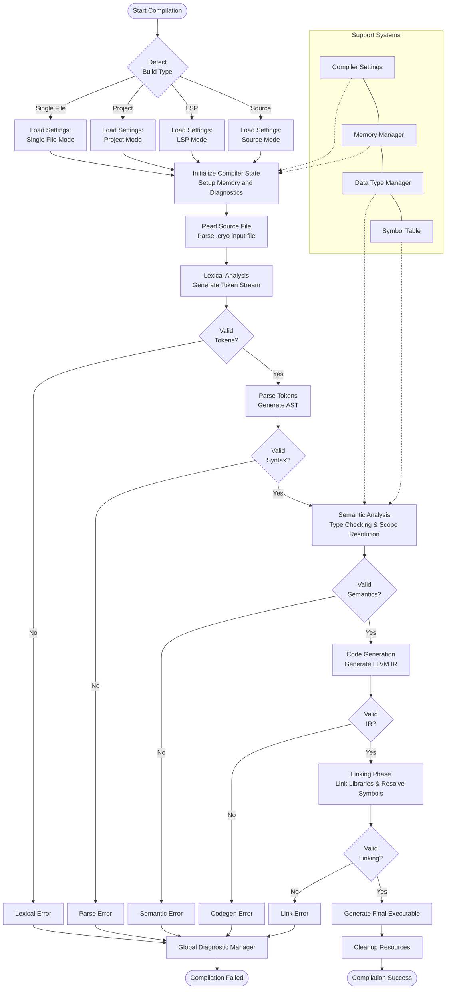

# The Cryo Compiler

This document describes the architecture of the Cryo compiler. The Cryo compiler is designed to be modular and extensible, allowing for easy addition of new features and improvements.

This is a passion project that is only maintained and developed by me, [Jake LeQuire](https://github.com/jakelequire). I am a self-taught developer and have treated this project as a learning experience and a way to improve my skills over the last year+. I have learned a lot about compiler design and implementation, and I hope to continue to improve the compiler over time.

I have no intentions of making this a production-ready compiler / language, but I do hope to make it a fun and interesting project to work on.

See the [release notes](./releaseNotes.md) for a list of features and improvements in each version of the compiler.

## Table of Contents
- [Compiler Architecture](#compiler-architecture)
    - [Additional Components](#additional-components)
    - [Design Philosophy](#design-philosophy)
        - [Minimizing Dependencies](#minimizing-dependencies)
        - [Integrated Build System](#integrated-build-system)
        - [Modular Architecture](#modular-architecture)
- [Compiler Flow](#compiler-flow)
- [Build System](#build-system)
    - [Core Build Infrastructure](#core-build-infrastructure)
    - [User-Facing Build Interface](#user-facing-build-interface)
    - [Development Environment](#development-environment)
    - [Build Configuration Management](#build-configuration-management)
- [Cryo CLI](#the-cryo-cli)
    - [Flags and Options](#flags-and-options)
- [Conclusion](#conclusion)

## Compiler Architecture
The Cryo compiler is designed to be modular and extensible. The compiler is divided into several components, each responsible for a specific part of the compilation process. The primary components are as follows:

- **Lexer:** The lexer is responsible for tokenizing the input source code. The lexer reads the source code and produces a stream of tokens that are passed to the parser.
- **Parser:** - The parser is responsible for parsing the stream of tokens produced by the lexer. The parser reads the tokens and produces an abstract syntax tree (AST) that represents the structure of the source code.
- **AST:** - The Abstract Syntax Tree is a data structure that represents the structure of the source code. The AST is used by the compiler to perform semantic analysis and code generation.
- **Semantic Analyzer:** - The semantic analysis component is responsible for performing semantic analysis on the AST. This includes type checking, scope resolution, and other semantic checks.
- **Codegen:** - The code generation component is responsible for generating the final output code from the AST. This includes generating machine code, bytecode, or any other output format.
- **Linker:** - The linker is responsible for linking the generated code with any external libraries or dependencies. The linker resolves symbols and produces the final executable or library. 

### Additional Components
In addition to the primary components, the Cryo compiler includes several additional components that provide additional functionality and support for the compilation process:

- **Data Type Manager:** - The Data Type Manager is responsible for managing the data types used in the source code. This includes defining new data types, managing type conversions, and ensuring type safety.
- **GDM (Global Diagnostic Manager):** - The GDM is responsible for managing diagnostics and error reporting. It collects and reports errors, warnings, and other diagnostics during the compilation process.
- **Symbol Table:** - The Symbol Table is a data structure that stores information about the symbols (variables, functions, etc.) in the source code. It is used by the semantic analyzer and code generation components to resolve symbols and perform type checking.
- **Compiler Settings:** - The Compiler Settings is responsible for managing the configuration of the compiler. This includes managing compiler flags, options, and other settings that affect the compilation process.

### Design Philosophy

The development of Cryo compiler was guided by several key principles that reflect both practical considerations and personal preferences.

#### Minimizing Dependencies
A foundational principle in building the Cryo compiler was maintaining a lean dependency profile. The compiler relies primarily on the C/C++ standard library, with LLVM serving as the only significant external dependency for code generation and optimization. This deliberate choice simplifies the build process, enhances portability across platforms, and gives me greater control over the compiler's behavior without wrestling with the complexities of multiple third-party libraries.

#### Integrated Build System
Another key design philosophy was to have the build system be a part of the compiler itself. From personal experiences, I have found that build systems can be a pain to work with, and I wanted to avoid that. The Cryo CLI is packaged with the compiler and provides a simple interface for building and running Cryo programs. This integration creates a unified experience for developers, who don't need to learn separate build tools beyond the compiler itself.

#### Modular Architecture
The Cryo compiler is designed with modularity in mind. Each component of the compiler is responsible for a specific part of the compilation process, allowing for easy addition of new features and improvements. This modular architecture also makes it easier to test and debug individual components, as well as to extend the compiler with new language features or optimizations.

## Compiler Flow
The flow of the Cryo compiler is as follows:

## Build System

The Cryo compiler employs a multi-layered build system designed for flexibility and developer convenience. The build system consists of several key components working together:

### Core Build Infrastructure

- **Primary Build System**: The [`makefile`](makefile) serves as the core build system, handling the compilation of C and C++ source files, managing dependencies, and linking objects into the final executable. It supports various build targets:
  - `make all` - Default target that builds everything
  - `make timed-build` - Builds with timing statistics
  - `make quick-build` - Faster build without running tests
  - `make verbose-build` - Build with additional compiler information
  - `make clean` - Removes build artifacts

- **Build Performance Tools**: The [`scripts/build_timer.py`](scripts/build_timer.py) script provides detailed timing statistics for builds, including:
  - Total build time measurement
  - Component-specific timing breakdowns
  - CPU and memory usage statistics
  - Color-coded build summaries for better visibility

### User-Facing Build Interface

- **CLI Tool**: The [`tools/cli/`](tools/cli/) provides a user-friendly interface for compilation, making the build process more intuitive:
  - `cryo build` - Build a project in the current directory
  - `cryo build -f <file>` - Compile a single file
  - `cryo build --dev` - Build with development logging enabled
  - `cryo init` - Initialize a new Cryo project with default settings

### Development Environment

- **Development Server**: The [`tools/dev-server/`](tools/dev-server/) monitors the codebase for changes and automatically triggers rebuilds:
  - File watching capabilities for real-time development
  - Automatic recompilation when source files change
  - Status notifications for build success/failure
  - Accessible via `cryo devserver` command

### Build Configuration Management

- **Compiler Settings**: The [`include/settings/compilerSettings.h`](include/settings/compilerSettings.h) provides configuration for different build types:
  - Development builds (`BUILD_DEV`)
  - Debug builds (`BUILD_DEBUG`) 
  - Release builds (`BUILD_RELEASE`)
  - Build flags for optimization levels and feature toggles

- **Project Configuration**: The [`tools/cryoconfig/`](tools/cryoconfig/) handles project-specific settings:
  - Project structure definitions
  - Module dependencies
  - Output customization

## Cryo CLI
The Cryo CLI is a command-line interface that provides a user-friendly way to interact with the Cryo compiler. It allows users to compile Cryo source files, manage projects, and perform various tasks related to the compilation process.
The CLI is designed to be intuitive and easy to use, with commands that are similar to other popular build systems. The CLI is built on top of the core build infrastructure and provides a convenient way to interact with the compiler.
The CLI is located in the `tools/cli/` directory and can be run using the `cryo` command. The CLI provides several commands, including:
- `cryo build`: Compiles the current project or a specified file.
- `cryo clean`: Cleans the build artifacts for the current project.
- `cryo init`: Initializes a new Cryo project with default settings.

The CLI also supports various options and flags to customize the build process, such as enabling development mode, specifying output directories, and more. The CLI is designed to be extensible, allowing for easy addition of new commands and features in the future.

### Flags and Options
The Cryo CLI supports various flags and options to customize the build process. Some of the common flags include:
- `--dev`: Enables development mode, which provides additional logging and debugging information during the build process.
- `-g | --gdb`: Generates debug symbols for GDB, allowing for easier debugging of the compiled code.
- `-f <file>`: Specifies a single Cryo source file to compile, overriding the default behavior of compiling the entire project.
- `--clean`: Cleans the build artifacts for the current project, removing any previously compiled files.

For a complete list of available commands and options, you can run `cryo --help` in the terminal.

## Conclusion

The Cryo compiler stands as both a technical achievement and a personal journey into the fascinating world of language design and compilation. Its modular architecture demonstrates how complex systems can be decomposed into clean, interconnected components that work in harmony to transform human-readable code into executable programs.

Over the past year, this passion project has evolved from a learning exercise into a comprehensive exploration of compiler construction, software architecture, and the intricate challenges of building a programming language from the ground up. Every component—from the lexer's token stream to the final executable generation—reflects lessons learned and principles discovered along the way.

While Cryo may not be destined for production environments, it represents something equally valuable: the spirit of curiosity-driven development and the satisfaction that comes from building something meaningful with your own hands. The project embodies the philosophy that the journey of creation is often as rewarding as the destination itself.

This documentation captures the current state of Cryo's architecture and the design decisions that shaped its development. As a self-taught developer, I recognize that every project is an opportunity to grow, and I'm always eager to learn from the broader community.
